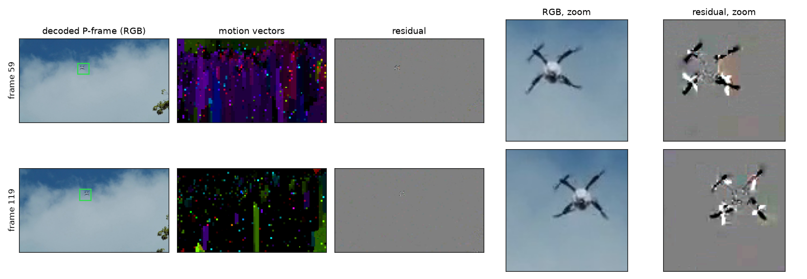
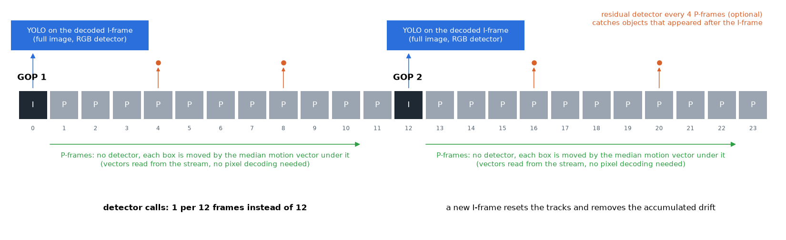
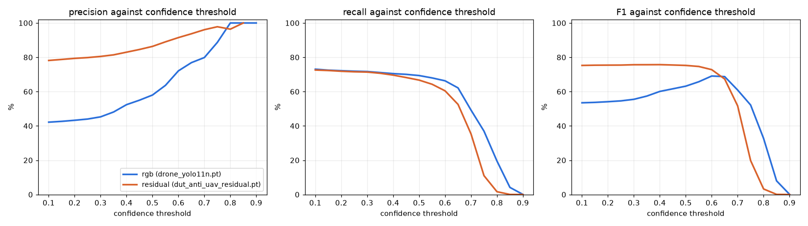

# compressed-detection

Compressed-domain video analysis for drone detection, following the CoViAR idea (Wu et al., CVPR 2018): work on I-frames, motion vectors and residuals instead of fully decoded frames. CPU only.

## Extraction

Videos are re-encoded to H.264 with a GOP of 12, no B-frames and a single reference frame, then decoded with PyAV. Motion vectors come from FFmpeg (`export_mvs`). Residuals are computed as the current frame minus the previous frame warped by the motion vectors.

```bash
docker compose build
docker compose run --rm extract data/videos/clip.mp4
docker compose run --rm --entrypoint python extract scripts/mosaic.py
```

Output in `results/compressed/<video>/`:

- `frames/` decoded frames, `000012_I.jpg`, `000013_P.jpg`
- `residuals/` residual images (128 = zero)
- `mv/` motion vectors drawn on the frame
- `flow/` motion field as color (hue = direction, brightness = magnitude)
- `raw/` residual (int16) and motion vectors as `.npz`, if `save.raw` is enabled
- `decoded.mp4`, `residual.mp4`, `mv.mp4`, `flow.mp4`
- `mosaic.jpg` frame / motion / residual side by side (`scripts/mosaic.py`)
- `frames.csv` frame type, number of vectors, residual MAE

Parameters are in `configs/compressed.yaml`.

## Figures

Regenerate with `python scripts/make_figures.py` (reads `results/`).

RGB, motion vectors and residual of the same P-frames, with a zoom on the drone. The residual is flat grey where the motion vectors explain the frame, so the drone is nearly all that is left.



One GOP: the detector runs on the I-frame, the P-frames only move the boxes with the stream's motion vectors, the residual detector is optional (`scripts/track_gop.py`).



Confidence on DUT Anti-UAV, held-out sequences, same ByteTrack settings, `conf` 0.1 (`results/metrics_dut_anti_uav_test_platform_*_heldout.json`). At the lowest threshold the recall is the same (73.1 % RGB, 72.6 % residual) but the precision is 42.2 % for the RGB model and 78.2 % for the residual one; the RGB model needs a threshold of about 0.7 to reach the precision the residual model has at 0.1, and loses recall on the way.



## Datasets

One folder per dataset in `data/`, converted to MOTChallenge format in `data/mot/<dataset>/<split>/<sequence>/` (`gt.txt`, `seqinfo.ini`, `video.mp4` encoded with the settings above). Common class list in `configs/mot.yaml`, statistics in `results/datasets.json`.

| Dataset | Content | Splits | License |
| --- | --- | --- | --- |
| [VisDrone2019-MOT](https://github.com/VisDrone/VisDrone-Dataset) | vehicles and pedestrians from a drone | train 56, val 7, test-dev 17 | research only |
| [UAVDT](https://sites.google.com/view/grli-uavdt/) | vehicles from a drone | train 30, test 20 | research only |
| [DUT Anti-UAV](https://github.com/wangdongdut/DUT-Anti-UAV) | drones, single target | 20 sequences | Apache-2.0 |

```bash
docker compose run --rm --entrypoint python extract scripts/download_datasets.py
docker compose run --rm --entrypoint python extract scripts/convert_mot.py
```

VisDrone is on Google Drive and often hits the download quota: download the zips in a browser and put them in `data/visdrone_mot/archives/`.

## Platform

`project.yaml` plugs the project into [mlops-platform](https://github.com/nThArOs/mlops-platform) with two models, `residual` and `rgb`, sharing the same entrypoints through the `{input}` variable:

| Entrypoint | Script | Output |
| --- | --- | --- |
| `train` | `scripts/train_yolo.py --tag platform` | `models/dut_anti_uav_{input}_platform.pt`, epochs logged to the platform run |
| `evaluate` | `scripts/track.py` then `scripts/eval_mot.py` on the held-out sequences | `results/metrics_dut_anti_uav_test_platform_{input}_heldout.json` |
| `benchmark` | `scripts/benchmark.py` | latency per stage, fps, peak RAM, size, GFLOPs under the CPU limits of the container |
| `export` | `scripts/export.py --format onnx\|onnx-int8` | ONNX model; INT8 is calibrated on training frames and keeps the detection head in float |
| `serve` | `scripts/serve.py` | live detection on a list of videos, Prometheus metrics, `/frame.jpg` preview |

Runs started by the platform never overwrite `models/dut_anti_uav_residual.pt` or the existing results.

`eval_mot.py` adds operational metrics to the TrackEval scores: precision, recall and F1 of the boxes, false alarms per hour (false tracks), share of time with a false alarm on screen, delay to the first detection, recall by drone size (`size_edges` in `configs/track.yaml`), precision and recall against the confidence threshold, and 95 % bootstrap intervals over the sequences.

`serve.py` and `benchmark.py` size the PyTorch thread pool from the container CPU quota, so a 2-CPU profile does not run 16 threads.
